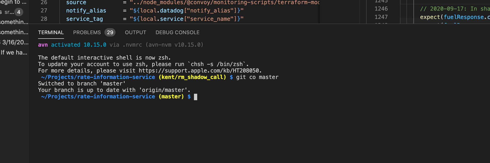
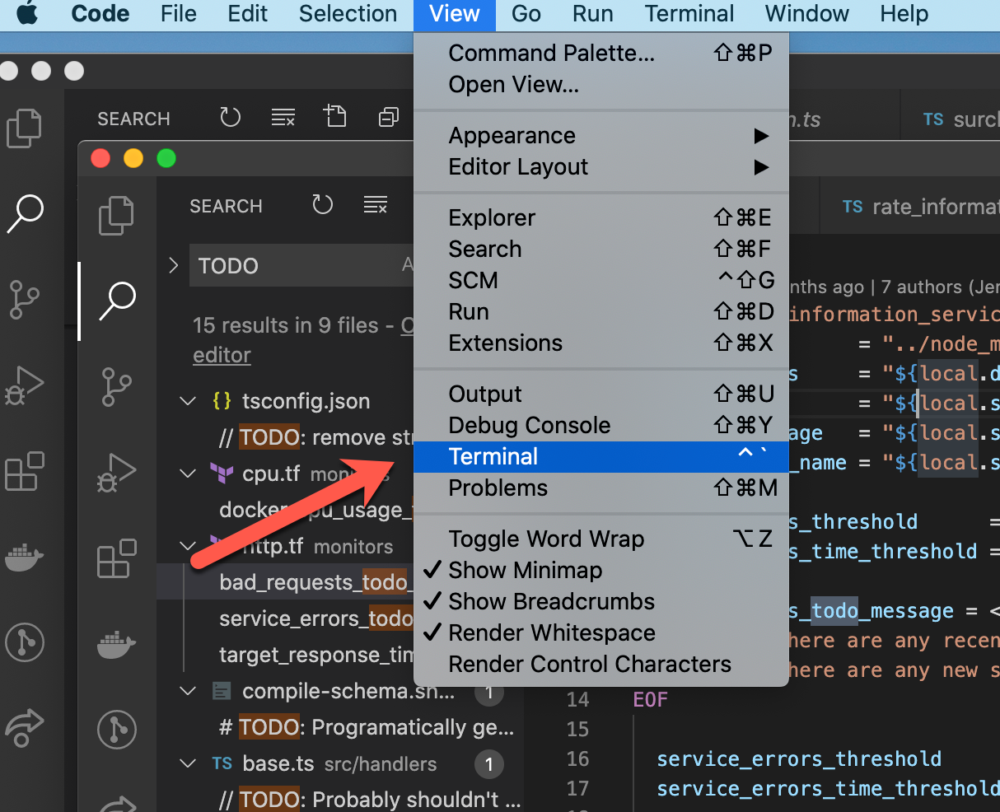

# Command Line Basics
## Why
The command line often can provide us faster ways to do common tasks and on occasion we are not able to do the same things in a user interface or tool like VS Code.

And like many things, it is just another way to do the same thing.  This gives us options and shows us an approach that we might use in our own development.

## What is the command line?
You may or many not have used the command line while working on your computer.  It is referred to by many names:  Command Line, Terminal, or Console.  It shows up in several places.

This is the old way to deal with files and directories on a computer before we could drag and drop with the mouse.  They exist on most computer systems.  In the case of the current Macs, it is based on the Unix commands.

Unix commands very from the ones used by Windows, though with recent changes, even Windows systems have Unix commands.  So much of what is here you can use universally across systems.

## How can you get to the command line?
On the Mac you can type `⌘-spacebar` and type terminal.  That will open a new terminal

If you happen to have VS Code open you may see it at the bottom off the screen as "Terminal"


If it isn't visible you can pull it up with the menu


## Commands
So now that we have a command line open there are a few commands that will help us move around and know where we are.  Below I use the term _argument_  It just means the input place.  So if I say first argument I am referring to first input to the command.  Example:  The first argument to the `cd` command is the place you want to change too.  You will hear it shorted as arg.

**cd** Change directory You can give it places to go.  The first argument is the location to change to.  Examples:
```
cd Documents
cd Downloads
cd ~
```
The last one is special.  It means, take me back to my home directory.  This
will be /Users/<username>

**pwd** Print working directory   Unless you have configured your terminal you may not have it shown where you currently are.  pwd will show you that and keep you from getting lost.  Example:
```
cd ~
pwd
```

**ls** Listing  List out the files in a directory.  This lets you know what is in the directory.  There are a lot of different arguments that you can pass to this command.  For now we will just show a few to filter what files you see when you run ls Examples:
```
ls
ls *.png
ls 2020-*
```
1. lists all the files in the directory
1. lists all the files that end with `.png`
1. lists all the files that start with `2020-`

The asterisks, *, is a wild card telling the command that anything can be in that place.

**mkdir** Create a new directory.  The first argument is the name of the
directory you want to create.  Example:
```
cd ~
mkdir Projects
cd Projects
```
You now have a place where you can put all your projects.  That might be
git repositories that you are working on or just other directories where you have different files.

Directories allow you a way to organize your files.  The choice is yours in how you organize.  Maybe you want to track your pictures by the month you took them or by the trip you took.  By making directories you can organize to your liking so it is easier for you to find what you are looking for.

**rmdir** Remove Directory  Used for removing a directory you no longer need.  The first argument is the name of the directory you want to remove.  Example:
```
mkdir random
rmdir random
```

## On to Git
Now that you have the basics of the terminal, you can dive into what to do to start learning the basics of git.  [Git Tutorial](/git-tutorial/README.md)

## Further information
There are a lot of great resources on the web that you can use to learn
more.
[Cheat sheet of many commands](https://gist.github.com/poopsplat/7195274)
[Another walk through tutorial](https://computers.tutsplus.com/tutorials/navigating-the-terminal-a-gentle-introduction--mac-3855)
[Older Apple Developer Documentation](https://developer.apple.com/library/archive/documentation/OpenSource/Conceptual/ShellScripting/CommandLInePrimer/CommandLine.html) - This is a great place to explore more though it will probably be a bit terse to start off.